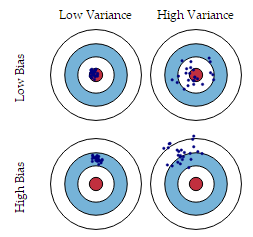

深度学习是机器学习的一个特定分支，要想充分理解深度学习，就必须对机器学习的基本原理有深刻的理解。机器学习的本质属于应用统计学，其更多地关注如何用计算机统计地估计复杂函数，而不太关注为这些函数提供置信区间，大部分机器学习算法可以分成监督学习和无监督学习两类；通过组合不同的算法部分，例如优化算法、代价函数、模型和数据集可以建立一个完整的机器学习算法。
## 一，Bias(偏差)，Error(误差)和Varience(方差)
> [机器学习中的Bias(偏差)，Error(误差)，和Variance(方差)有什么区别和联系？](https://www.zhihu.com/question/27068705)

偏差-方差指标方法是试图对学习算法(模型)的期望泛化错误率进行拆解。`Error = Bias + Varience`：
+ `Error`: 反映的是整个模型的准确度
+ `Bias`: 反映的是模型在**样本上的输出与真实值之间的误差**，即模型的准确性，以打靶事件为例，`low bias`，一般就得复杂化模型，表现出来就是点都打在靶心中间，但这样容易过拟合 (overfitting)，过拟合对应下图是 high variance，点很分散。
+ `Varience`: 反映的是模型每一次输出的结果与模型输出期望之间的误差，即模型的稳定性，是训练集上训练出来的模型在测试集上的表现，同样以打靶事件为例，`low variance` 对应就是点都打的很集中，但不一定是靶心附近，手很稳，但是瞄的不准。

### 1.1，偏差与方差公式
对测试样本 `x`, 令 $y_{D}$ 为 x 在数据集中的标记，y 为 x 的真实标记， `f(x;D)` 为在训练集 D 上学习到的模型 f 在 x 上的预测输出。
+ 训练过程中期望输出与真实标记（标签）的差别称为偏差（`bias`）：$bias^{2}(x) = (\bar{f} - y)^{2}$
+ （交叉验证训练模型）使用样本数相同不同训练集训练出来的模型在测试集上产生的`方差`为： $var(x) = E_{D}[(f(x;D) - \bar{f})^{2}] $
### 1.2，导致偏差和方差的原因
>  [机器学习中的Bias(偏差)，Error(误差)，和Variance(方差)有什么区别和联系？](https://www.zhihu.com/question/27068705)

+ 偏差通常是由于我们对学习算法做了错误的假设，或者模型的复杂度不够；
    + 比如真实模型是一个二次函数，而我们假设模型为一次函数，这就会导致偏差的增大（欠拟合）；
    + 由偏差引起的误差通常在训练误差上就能体现，或者说训练误差主要是由偏差造成的
+ 方差通常是由于模型的复杂度相对于训练集过高导致的；
    + 比如真实模型是一个简单的二次函数，而我们假设模型是一个高次函数，这就会导致方差的增大（过拟合）；
    + 由方差引起的误差通常体现在测试误差相对训练误差的增量上。
### 1.3，深度学习中的偏差与方差
+ 神经网络的拟合能力非常强，因此它的训练误差（偏差）通常较小；
+ 但是过强的拟合能力会导致较大的方差，使模型的测试误差（泛化误差）增大；
+ 深度学习的核心工作之一就是**研究如何降低模型的泛化误差**，这类方法统称为`正则化方法`。
### 1.4，交叉验证
在训练数据上面，我们可以进行·交叉验证(Cross-Validation)·。一种方法叫做 ·`K-fold Cross Validation` ( K 折交叉验证), K 折交叉验证，初始采样分割成 K 个子样本，一个单独的子样本被保留作为验证模型的数据，其他 K-1 个样本用来训练。交叉验证重复 K 次，每个子样本验证一次，平均 `K` 次的结果或者使用其它结合方式，最终得到一个单一估测。
+ 当 `K` 值大的时候， 我们会有更少的 `Bias`(偏差), 更多的 `Variance`。
+ 当 `K` 值小的时候， 我们会有更多的 `Bias`(偏差), 更少的 `Variance`。
## 二，先验概率与后验概率
> 这章知识的公式、定理、概念比较多，会难以理解，建议手推公式。
### 2.1，条件概率
一个事件发生后另一个事件发生的概率。设 A 与 B 为样本空间 Ω 中的两个事件，其中 P(B)>0。那么在事件 B 发生的条件下，事件 A 发生的条件概率为：
$$P(A|B) = \frac {P(A\cap B)} {P(B)}$$
### 2.2，先验概率
事件发生前的概率，可以是基于以往经验/分析，也可以是基于历史数据的统计，甚至可以是人的主观观点给出。一般是**单独**事件概率，如 P(x), P(y)。
### 2.3，后验概率
+ 事情已经发生，要求这件事情发生的原因是由某个因素引起的可能性的大小（**由果推因**：就是在知道“果”之后，去推测“因”的概率）
+ 后验概率和和先验概率的关系可以通过`贝叶斯`公式求得，公式如下：
$$P(B_{i}|A) = \frac {P(B_{i}\cdot P(A|B_{i}}{P(B_{1})\cdot P(A|B_{1}) + P(B_{2})\cdot P(A|B_{2}) }$$
### 2.4，贝叶斯公式
贝叶斯公式是建立在条件概率的基础上寻找事件发生的原因（即大事件 `A` 已经发生的条件下，分割中的小事件 `Bi` 的概率），设 `B1,B2,...` 是样本空间 `Ω` 的一个划分，则对任一事件 `A（P(A)>0)`, 有：$$P(B_{i}|A) = \frac {P(A|B_{i})P(B_{i})}{\sum_{j=1}^{n}P(B_{j})P(A|B_{j})}$$

+ `Bi` 常被视为导致试验结果A发生的”原因“；
+ `P(Bi)(i=1,2,...)` 表示各种原因发生的可能性大小，故称先验概率；
+ `P(Bi|A)(i=1,2...)` 则反映当试验产生了结果A之后，再对各种原因概率的新认识，故称后验概率。
### 2.5，后验概率实例
假设一个学校里有 `60％` 男生和 `40%` 女生。女生穿裤子的人数和穿裙子的人数相等，所有男生穿裤子。一个人在远处随机看到了一个穿裤子的学生。那么这个学生是女生的概率是多少？
+ 使用贝叶斯定理，事件A是看到女生，事件B是看到一个穿裤子的学生。我们所要计算的是 $P(A|B)$。
+ $P(A)$ 是忽略其它因素，看到女生的概率，在这里是 40%；
+ $P(A')$ 是忽略其它因素，看到不是女生（即看到男生）的概率，在这里是 60%；
+ $P(B|A)$ 是女生穿裤子的概率，在这里是 50%；
+ $P(B|A')$ 是男生穿裤子的概率，在这里是 100%；
+ $P(B)$ 是忽略其它因素，学生穿裤子的概率，$P(B) = P(B|A)P(A) + P(B|A')P(A')$，在这里是 0.5×0.4 + 1×0.6 = 0.8。

根据贝叶斯定理，我们计算出后验概率P(A|B):
$$P(A|B) = \frac {P(B|A)P(A)}{P(B)} = \frac {0.5\times 0.4} {0.8}$$
## 三，似然函数
## 四，最大似然估计
## 五，容量、过拟合和欠拟合
## 六，交叉验证
交叉验证是机器学习当中的概念，一般深度学习不会使用交叉验证方法，原因是深度学习的数据集一般都很大，但是也有例外，`Kaggle` 的一些医疗类比赛，训练集一般只有几千张，由于训练数据很少，用来作为验证集的数据会非常少，因此训练的模型其验证分数可能会有很大波动，直接取决于我们所选择的验证集和训练集，也就是说，验证集的划分方式可能会造成验证分数上存在较大**方差**，无法对模型进行有效评估，同时也无法进行有效的超参数调整（`batch` 设置多少模型最佳收敛）。

也有替代方法允许我们使用所有的样本估计平均测试误差，代价是增加了计算量。这些过程是基于在原始数据上随机采样或分离出的不同数据集上重复训练和测试的想法，最常见的是 k-折交叉验证，这种方法将可用训练集花费为 `K` 个分区（一般取 `4`、`5`或者`10`），实例化训练 `k` 个相同模型，将每个模型在 `k-1` 个分区上训练，并在剩下的一个分区做验证，模型的验证分数等于 `k` 个验证分数的平均值。k-折交叉验证的数据集划分方式如下图所示：

`k` 折交叉验证的代码实现可以参考《Python深度学习》第三章，在模型训练好后，可通过计算所有 `Epoch` 的 `K` 折验证分数的平均值，并绘制每轮的模型验证指标变化曲线，观察哪个 `Epoch` 后模型不再收敛，从而完成模型调参工作。同时，`K` 折交叉验证方式训练模型会得到 `K`个模型，将这个 `K` 个模型在测试集上的推理结果取平均值或者投票，也是一种 `Ensemble` 方式，可以增强模型泛化性，防止过拟合。
## 参考资料
1. [机器学习基础](https://github.com/imhuay/Algorithm_Interview_Notes-Chinese/blob/master/A-%E6%9C%BA%E5%99%A8%E5%AD%A6%E4%B9%A0/A-%E6%9C%BA%E5%99%A8%E5%AD%A6%E4%B9%A0%E5%9F%BA%E7%A1%80.md)
2. [机器学习中的Bias(偏差)，Error(误差)，和Variance(方差)有什么区别和联系？](https://www.zhihu.com/question/27068705)
3. [先验概率，后验概率，似然概率，条件概率，贝叶斯，最大似然](https://blog.csdn.net/suranxu007/article/details/50326873)
4. [你对贝叶斯统计有何理解](https://www.zhihu.com/question/21134457/answer/169523403)
